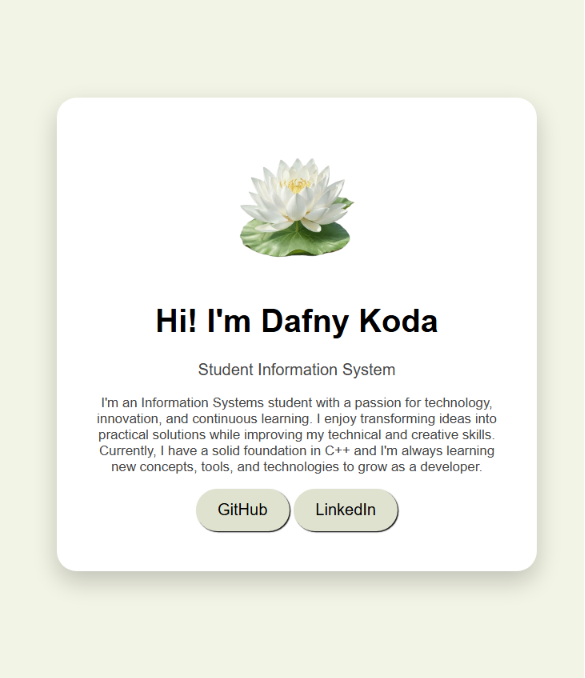

<div align="center">

# Cartão de Apresentação

Projeto desenvolvido durante meus estudos de **HTML5** e **CSS3**, com foco na criação de um cartão de apresentação moderno e responsivo.

<a href="https://dafnykoda.github.io/projeto-cartao/" target="_blank">

</a>

<a href="https://github.com/dafnykoda/projeto-cartao" target="_blank">

</a>

</div>

---

## 📷 Preview

<p align="center">
  
</p>

---

## 🚀 Tecnologias

<p align="center">

</p>

---

## 📚 Conceitos praticados

- Estrutura semântica com HTML5
- Estilização com CSS3
- Flexbox
- Organização de arquivos
- Responsividade básica
- Links externos
- Boas práticas de desenvolvimento

---

## 📁 Estrutura do projeto

```text
📦 projeto-cartao
 ┣ 📂 img
 ┣ 📄 index.html
 ┣ 🎨 style.css
 ┗ 📖 README.md
```

---

## 🎯 Objetivo

Este projeto faz parte do meu portfólio de estudos e representa minha evolução no desenvolvimento Front-end.

Cada novo projeto publicado busca aplicar novos conceitos aprendidos durante minha formação em Sistemas de Informação.

---

<div align="center">

### 🤍 Contato

**Dafny Koda**

<a href="https://github.com/dafnykoda">

</a>

<a href="https://www.linkedin.com/in/dafny-koda-746a21352/">

</a>

</div>